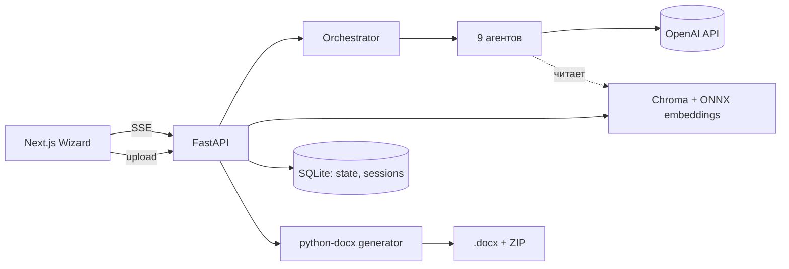

# Research Preparation Agent

AI-система подготовки UX-исследований. По короткому описанию задачи проводит заказчика через wizard из 7 шагов и на выходе отдаёт полный пакет документов: бриф, гайд, скринер, дизайн исследования, шаблон инсайтов, чеклист запуска, briefing для интервьюера.

**Stack:** Next.js 14 (App Router, Zustand, Tailwind) + FastAPI (SQLAlchemy, SQLite) + Chroma (локальные ONNX embeddings) + OpenAI SDK.

---

## Что внутри

### State machine

Этапы прогоняются строго по порядку. Состояние сессии хранится в одной JSON-колонке SQLite, передаётся между агентами явно — у LLM нет памяти между вызовами.

```
intake → clarify → brief → context → hypothesis → method → sampling → design → done
```

### Агенты

| Агент | Стадия | Модель | Что делает |
| --- | --- | --- | --- |
| `BriefAgent` (intake) | intake | mini | Задаёт 2–3 уточняющих вопроса по задаче |
| `BriefAgent` (diagnosis) | clarify | main | По диагностической форме формирует цель и задачи исследования |
| `BriefAgent` (brief) | brief | main | Собирает финальный бриф |
| `ContextAgent` | context | main | Извлекает паттерны из брифа и RAG-фрагментов загруженных документов |
| `HypothesisAgent` | hypothesis | main | Формулирует 5–15 проверяемых гипотез с привязкой к методам |
| `MethodAgent` | method | main | Выбирает метод (или цепочку методов) по типу неопределённости |
| `SamplingAgent` | sampling | main | Определяет выборку, критерии включения, скринер |
| `DesignInterviewsAgent` | design | main | Гайд глубинного интервью |
| `DesignUsabilityAgent` | design | main | Сценарий юзабилити-теста |
| `DesignSurveyAgent` | design | main | Анкета опроса |
| `DesignAgent` | design | main | Fallback для прочих методов |
| `validate_clarity` | pre-flight | mini | Проверяет качество брифа до запуска тяжёлых шагов |

Все агенты наследуются от `BaseAgent` (`backend/agents/base.py`), стримят ответ через OpenAI SSE, парсятся как JSON.

### Архитектура



### RAG

Загруженные пользователем документы (`.pdf`, `.docx`, `.txt`, `.csv`) разбиваются на чанки и индексируются в Chroma. Embeddings — локальная ONNX-модель (Chroma default), **никаких вызовов в OpenAI на этом слое**.

- Лимиты: 25 MB на файл, 50 MB на сессию.
- Индексация выполняется в `BackgroundTask` после ответа upload-эндпоинта.
- На этапе `context` фрагменты подмешиваются в промпт `ContextAgent`.

### Документы

`backend/documents/generator.py` собирает шесть `.docx` из финального состояния сессии:

- Discussion Guide
- Рекрутинговый скринер
- Briefing для интервьюера
- Шаблон инсайтов
- Дизайн исследования
- Чеклист запуска

ZIP-пакет — все шесть документов одним архивом.

---

## Структура репозитория

```
.
├── backend/
│   ├── main.py                       # FastAPI app + fail-fast на env
│   ├── orchestrator.py               # State machine (intake → done)
│   ├── agents/
│   │   ├── base.py                   # BaseAgent, OpenAI клиент, утилиты выбора гипотез
│   │   ├── brief.py                  # intake / diagnosis / brief
│   │   ├── context.py
│   │   ├── hypothesis.py
│   │   ├── method.py
│   │   ├── sampling.py
│   │   ├── design.py                 # fallback
│   │   ├── design_interviews.py
│   │   ├── design_usability.py
│   │   ├── design_survey.py
│   │   └── validator.py              # pre-flight clarity check
│   ├── api/
│   │   ├── session.py                # POST /api/session, GET /api/session/{id}
│   │   ├── stream.py                 # POST /api/stream/{id} (SSE), advance, retreat
│   │   ├── upload.py                 # POST /api/upload/{id}, DELETE
│   │   ├── download.py               # GET /api/download/{id}
│   │   ├── validate.py               # POST /api/validate-clarity
│   │   ├── deps.py                   # owner_token guard
│   │   └── locks.py                  # per-session asyncio lock
│   ├── rag/
│   │   ├── client.py                 # Chroma PersistentClient
│   │   ├── indexer.py                # PDF / DOCX / TXT / CSV → chunks
│   │   └── retriever.py
│   ├── documents/generator.py        # .docx генератор
│   ├── prompts/                      # SYSTEM-промпты для design-агентов
│   ├── db/
│   │   ├── database.py
│   │   └── models.py                 # Session(id, owner_token, state: JSON)
│   └── requirements.txt
│
├── frontend/
│   ├── app/
│   │   ├── page.tsx                  # LandingScreen (3-шаговая форма)
│   │   └── session/[id]/page.tsx     # Wizard
│   ├── components/wizard/
│   │   ├── ClarifyScreen.tsx
│   │   ├── ResearchDiagnosisScreen.tsx
│   │   ├── BriefScreen.tsx
│   │   ├── ContextUploadScreen.tsx
│   │   ├── HypothesesScreen.tsx
│   │   ├── MethodScreen.tsx
│   │   ├── SamplingScreen.tsx
│   │   ├── DesignScreen.tsx
│   │   └── OutputScreen.tsx
│   ├── store/session.ts              # Zustand
│   ├── lib/                          # auth, validateClarity, useSSE
│   └── types/
│
└── docs/                              # Итерации, методичка, launch-plan
```

---

## Быстрый старт

### Бэкенд

```bash
cd backend
cp .env.example .env       # заполнить OPENAI_API_KEY, OPENAI_MODEL, OPENAI_MODEL_MINI
pip install -r requirements.txt
uvicorn main:app --reload --port 8000
```

При запуске `main.py` падает с понятной ошибкой, если не заданы обязательные переменные — `OPENAI_API_KEY`, `OPENAI_MODEL`, `OPENAI_MODEL_MINI`. Тихих fallback-ов на модель по умолчанию нет.

### Фронтенд

```bash
cd frontend
cp .env.local.example .env.local
npm install
npm run dev
```

Открыть `http://localhost:3000`.

---

## Self-host (Docker)

Запуск всего стека одной командой через `docker-compose`. Никаких локальных Python/Node — только Docker Desktop (или Colima на mac). Внешние зависимости — только OpenAI API.

### Запуск

```bash
cp .env.example .env
# открой .env и впиши OPENAI_API_KEY, OPENAI_MODEL, OPENAI_MODEL_MINI

docker compose -p research-agent up -d --build
```

Первая сборка займёт 3–5 минут (бэк ~1 ГБ образ — ChromaDB и её ML-deps). После старта:

- UI: http://localhost:3001
- Backend health: http://localhost:8001/health

При первом обращении к RAG ChromaDB скачает ONNX-модель эмбеддингов (~80 МБ) — один раз, дальше из кэша.

### Где лежат данные

Всё пишется в `./data/` на хосте (bind mount), не теряется при пересоздании контейнеров:

```
./data/
├── research_agent.db        # SQLite — сессии и состояние
├── chroma_db/               # векторный индекс RAG
├── uploads/<session_id>/    # загруженные пользователем файлы
└── outputs/<session_id>/    # сгенерированные .docx
```

Сброс состояния под ноль: `docker compose -p research-agent down && rm -rf data`.

### Частые команды

```bash
# логи
docker compose -p research-agent logs -f backend
docker compose -p research-agent logs -f frontend

# остановить (контейнеры останутся, можно поднять снова без пересборки)
docker compose -p research-agent stop

# поднять без пересборки
docker compose -p research-agent up -d

# пересобрать после изменения кода или зависимостей
docker compose -p research-agent up -d --build

# полностью удалить контейнеры (данные в ./data остаются)
docker compose -p research-agent down
```

### Сменить порты

В `docker-compose.yml` в секции `ports` левая цифра — хост, правая — внутренний порт контейнера. Дефолт `"3001:3000"` для фронта и `"8001:8000"` для бэка специально не 3000/8000, чтобы не конфликтовать с локальным dev-сервером.

После смены хост-портов **обязательно** обновить:
- `environment.CORS_ORIGINS` у `backend` — новый origin фронта.
- `args.NEXT_PUBLIC_BACKEND_URL` у `frontend` — новый адрес бэка с точки зрения браузера (это запекается в JS-бандл на build).

И пересобрать: `docker compose -p research-agent up -d --build`.

### Особенности

- **Архитектура образов.** Сборка идёт под архитектуру хоста (`docker build` на Apple Silicon → arm64, на x86 Linux → amd64). Для multi-arch образа: `docker buildx build --platform linux/amd64,linux/arm64 ...`.
- **Имя проекта compose.** Флаг `-p research-agent` нужен, потому что имя репо-папки может содержать пробел/кириллицу — docker-compose сам имя проекта тогда не выводит.
- **SSE через прокси.** Фронт по умолчанию ходит к бэку напрямую (`NEXT_PUBLIC_BACKEND_URL=http://localhost:8001`), минуя Next.js-rewrites, потому что встроенный прокси Next буферит SSE до закрытия апстрима — длинные стримы агентов умирают по idle-таймеру. Backend CORS уже разрешает фронт-origin.

---

## Конфигурация (`backend/.env`)

| Переменная | Назначение | Обязательная |
| --- | --- | --- |
| `OPENAI_API_KEY` | Ключ OpenAI | да |
| `OPENAI_MODEL` | Основная модель (используется тяжёлыми агентами) | да |
| `OPENAI_MODEL_MINI` | Лёгкая модель (intake-агент, validator) | да |
| `OPENAI_MAX_CONCURRENCY` | Лимит параллельных вызовов OpenAI | нет (default 3) |
| `DATABASE_URL` | Строка подключения SQLAlchemy | нет (default — локальный SQLite) |
| `CHROMA_PERSIST_DIR` | Папка Chroma | нет (default `./chroma_db`) |
| `ANONYMIZED_TELEMETRY` | Отключение PostHog в Chroma | рекомендуется `False` |
| `CORS_ORIGINS` | CSV-список разрешённых origin-ов | нет (default `http://localhost:3000`) |

---

## API

Все защищённые эндпоинты требуют `X-Owner-Token` (или `?token=` для прямых ссылок на скачивание).

| Method | Path | Описание |
| --- | --- | --- |
| GET | `/` | Health check |
| GET | `/health` | Health check |
| POST | `/api/session` | Создать сессию. Возвращает `session_id` + `owner_token` |
| GET | `/api/session/{id}` | Получить полное состояние сессии |
| POST | `/api/stream/{id}` | SSE-стрим текущего этапа агента |
| POST | `/api/session/{id}/advance` | Перейти к следующему этапу |
| POST | `/api/session/{id}/retreat` | Откатиться на предыдущий этап |
| POST | `/api/upload/{id}` | Загрузить файл в RAG-контекст |
| DELETE | `/api/upload/{id}/{filename}` | Удалить файл (только на стадии context) |
| GET | `/api/download/{id}?doc=...&format=docx` | Скачать один документ |
| GET | `/api/download/{id}?format=zip` | Скачать ZIP-пакет |
| POST | `/api/validate-clarity` | Pre-flight проверка качества полей брифа |

### SSE-стрим

`/api/stream/{id}` отдаёт:
- `data: <chunk>` — куски ответа агента.
- `: keepalive` (heartbeat каждые 20 секунд) — против буферизации в Next dev proxy и Chrome fetch-reader на reasoning-only фазах.
- `data: [DONE]` — успешное завершение.
- `data: [ERROR] ...` — ошибка.

Frontend (`hooks/useSSE.ts`) держит idle-timer ~60 секунд + общий first-byte window 480 секунд.

---

## Экономика прогона

Замеры по реальным OpenAI usage за неделю (см. `docs/iteration-13.md`):

| Метрика | Значение |
| --- | --- |
| Средняя стоимость сессии | ~$0.91 |
| Худшая наблюдённая | $4.47 |
| LLM-вызовов на сессию | ~17 |
| Embeddings (локальный ONNX) | $0 — навсегда |
| Кэш input-токенов на основной модели | ~60% работает |

---

## Известные технические landmines

Зафиксированы в `docs/iteration-*.md` и в коде комментариями. Кратко:

- **`AsyncOpenAI`**** не делать singleton.** Iteration 8 → 9: module-level клиент вешал design-этап на 8 минут. Только fresh client per call.
- **SSE буферизация.** Next dev proxy + Chrome fetch reader глотают мелкие чанки. Решено padding-ом heartbeat-комментария до ~2 КБ.
- **SQLAlchemy + JSON колонка.** Мутация вложенного списка через `setdefault` не триггерит запись — нужен `flag_modified(row, "state")` при upload-апдейтах.
- **Chroma 0.5.23 telemetry.** PostHog ругается в логах, процесс не валит. Передаётся `Settings(anonymized_telemetry=False)` явно.
- **Token budget.** Тяжёлые агенты (Context, Method, дизайнерские) обрезались на 2048 токенов. Ceiling поднят до 8K–16K в зависимости от агента.

---

## Безопасность

- **Auth:** owner_token, выдаётся при создании сессии. Каждый защищённый эндпоинт проверяет токен через `api/deps.py`.
- **Upload:** ограничения по типу (`.pdf .docx .txt .csv`), размеру (25 MB / файл, 50 MB / сессия), path traversal заблокирован через `realpath` проверку внутри `uploads/{session_id}/`.
- **CORS:** список разрешённых origin-ов через `CORS_ORIGINS`.
- **Fail-fast:** обязательные env-переменные проверяются на старте.

### Frontend advisories

Frontend на `Next.js 14.2.35` (последний patch ветки 14.2.x). `npm audit` показывает 5 advisories — полное закрытие требует миграции на Next 16 + React 19 (breaking).

| Advisory | Применимость |
| --- | --- |
| Image Optimizer DoS / content injection | Нет — `next/image` и `remotePatterns` не используются |
| HTTP request smuggling в rewrites | Низкая — единственный rewrite проксирует только на собственный backend |
| DoS в React Server Components | Низкая — App Router без активной обработки RSC HTTP-запросов |
| postcss XSS в `</style>` | Только во внутренней зависимости Next, не в runtime CSS |
| `glob` CLI injection (через `eslint-plugin-next`) | Нет — dev-only, не вызывается |

Перед production-деплоем — обновить Next до 16+ и пересмотреть зависимости.

---

## Деплой

- **Frontend → Vercel.** `vercel deploy` из папки `frontend/`.
- **Backend → Railway / любой VPS с Docker.** Никаких системных зависимостей — образ Python + pip-deps.
- **Vercel для бэка не подходит** — SSE-стримы длятся минуты, serverless функции прибьют по таймауту.
- Нужен persistent volume для `research_agent.db`, `uploads/`, `chroma_db/`, `outputs/`.

---

## Документация процесса

В `docs/`:

- `methodology.md` — методичка по разработке (13 итераций реального проекта).
- `methodology-onepager.md` — короткая версия для быстрой загрузки в контекст.
- `iteration-*.md` — ретроспективы по итерациям.
- `launch-plan.md` — план публичного запуска.
